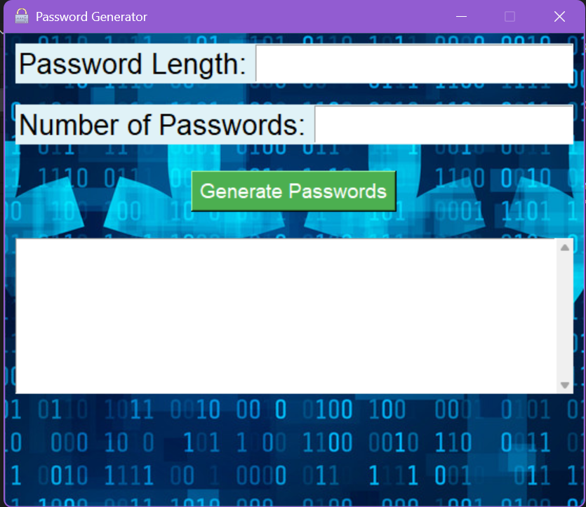

# Password Generator

This is a GUI-based password generator built using Python's Tkinter library. It allows users to specify the desired password length and the number of passwords to generate.

## Features

* **Customizable Password Length:** Users can input the desired length of the generated passwords.
* **Multiple Password Generation:** Users can specify the number of passwords to generate at once.
* **Scrollable Output:** Generated passwords are displayed in a scrollable text area.
* **User-friendly Interface:** The GUI is designed for ease of use.

## Screenshot



## How to Use

1.  Enter the desired password length in the "Password Length" field.
2.  Enter the number of passwords to generate in the "Number of Passwords" field.
3.  Click the "Generate Passwords" button.
4.  The generated passwords will be displayed in the text area below.

## Download

[Download Password Generator](https://minhaskamal.github.io/DownGit/#/home?url=https://github.com/ritika18b/Password-Generator)

## Installation

1.  Clone the repository:

    ```bash
    git clone https://github.com/ritika18b/Password-Generator.git
    ```

2.  Navigate to the project directory:

    ```bash
    cd Password-Generator
    ```

3.  Run the application:

    ```bash
    python password_generator.py
    ```

## Dependencies

* Python 3.x
* Tkinter library


